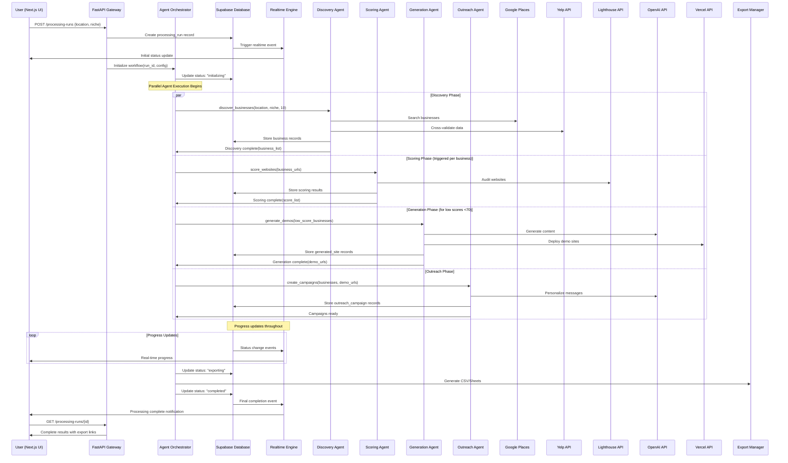

# Core Workflows

## Primary Agentic Processing Workflow

```mermaid
sequenceDiagram
    participant U as User (Next.js UI)
    participant API as FastAPI Gateway
    participant ORCH as Agent Orchestrator
    participant DB as Supabase Database
    participant RT as Realtime Engine
    participant DISC as Discovery Agent
    participant SCORE as Scoring Agent
    participant GEN as Generation Agent
    participant OUT as Outreach Agent
    
    U->>API: POST /processing-runs {location, niche}
    API->>DB: Create processing_run record
    DB->>RT: Trigger realtime event
    RT->>U: Initial status update
    
    API->>ORCH: Initialize workflow(run_id, config)
    ORCH->>DB: Update status: "initializing"
    
    Note over ORCH: Parallel Agent Execution Begins
    
    par Discovery Phase
        ORCH->>DISC: discover_businesses(location, niche, 10)
        DISC->>Google Places: Search businesses
        DISC->>Yelp API: Cross-validate data
        DISC->>DB: Store business records
        DISC->>ORCH: Discovery complete(business_list)
    and Scoring Phase (triggered per business)
        ORCH->>SCORE: score_websites(business_urls)
        SCORE->>Lighthouse API: Audit websites
        SCORE->>DB: Store scoring results
        SCORE->>ORCH: Scoring complete(score_list)
    and Generation Phase (for low scores <70)
        ORCH->>GEN: generate_demos(low_score_businesses)
        GEN->>OpenAI API: Generate content
        GEN->>Vercel API: Deploy demo sites
        GEN->>DB: Store generated_site records
        GEN->>ORCH: Generation complete(demo_urls)
    and Outreach Phase
        ORCH->>OUT: create_campaigns(businesses, demo_urls)
        OUT->>OpenAI API: Personalize messages
        OUT->>DB: Store outreach_campaign records
        OUT->>ORCH: Campaigns ready
    end
    
    Note over DB,RT: Progress updates throughout
    loop Progress Updates
        DB->>RT: Status change events
        RT->>U: Real-time progress
    end
    
    ORCH->>DB: Update status: "exporting"
    ORCH->>Export Manager: Generate CSV/Sheets
    ORCH->>DB: Update status: "completed"
    DB->>RT: Final completion event
    RT->>U: Processing complete notification
    
    U->>API: GET /processing-runs/{id}
    API->>U: Complete results with export links
```

---
