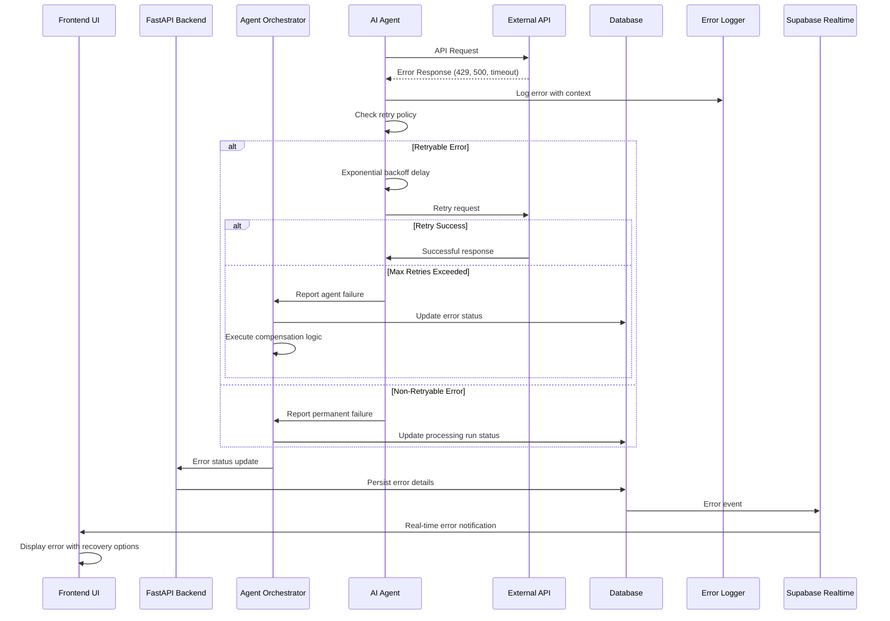

# Error Handling Strategy

## Error Response Format

```typescript
interface ApiError {
  error: {
    code: string;           // Machine-readable error code
    message: string;        // Human-readable error message
    details?: Record<string, any>; // Additional error context
    timestamp: string;      // ISO timestamp
    requestId: string;      // Unique request identifier
    retryable: boolean;     // Whether the error can be retried
    recoveryActions?: string[]; // Suggested recovery actions
  };
  context?: {
    runId?: string;         // Processing run context
    businessId?: string;    // Business context
    agentName?: string;     // Agent context
    operation?: string;     // Operation being performed
  };
}
```

## Error Flow



---
