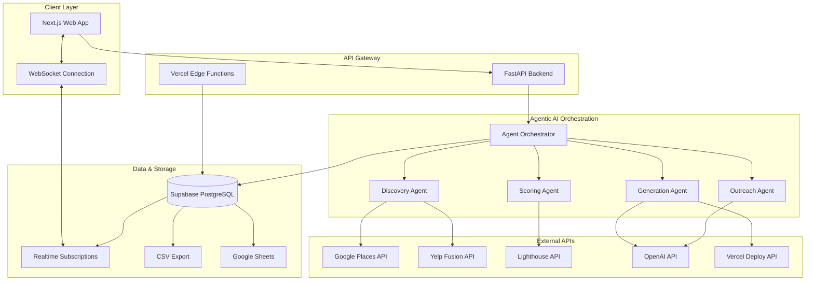

# High Level Architecture

## Technical Summary

The LeadGen Website Makeover Agent implements a **parallel-processing agentic architecture** built on FastAPI + Next.js, utilizing **Supabase** as the primary database with real-time subscriptions for progress tracking. The system orchestrates multiple AI agents working concurrently across business discovery (Google Places + Yelp), website scoring (Lighthouse + heuristics), demo generation (AI + Vercel deployment), and outreach creation, with comprehensive error handling through exponential backoff and circuit breakers. Real-time WebSocket connections provide live progress updates while maintaining data consistency through Supabase's ACID transactions and automatic retry mechanisms for the complex multi-step pipeline.

## Platform and Infrastructure Choice

**Recommendation: Vercel + Supabase**

**Platform:** Vercel (Frontend + Edge Functions) + Supabase (Database + Real-time + Auth)  
**Key Services:** Supabase PostgreSQL, Realtime subscriptions, Vercel Edge Functions, Vercel KV (caching)  
**Deployment Host and Regions:** Vercel (Global Edge), Supabase (US East)

## Repository Structure

**Structure:** Monorepo with workspace-based organization  
**Monorepo Tool:** npm workspaces (simpler than Turborepo for this scope)  
**Package Organization:** Apps (web, api) + shared packages (types, database, ai-agents)

## High Level Architecture Diagram

## Architectural Patterns

- **Orchestrator Pattern:** Central agent coordinator managing parallel workflows - _Rationale:_ Enables parallel processing while maintaining coordination and error recovery across the 4-step pipeline
- **Circuit Breaker Pattern:** Automatic API failure detection and fallback - _Rationale:_ Critical for external API reliability (Google, Yelp, Lighthouse) with graceful degradation
- **Event Sourcing (Lightweight):** Track each processing step as events - _Rationale:_ Enables real-time progress tracking and retry mechanisms for failed steps
- **CQRS (Command Query Responsibility Segregation):** Separate read/write models - _Rationale:_ Optimizes real-time progress queries while handling complex write operations
- **Saga Pattern:** Distributed transaction handling across agents - _Rationale:_ Manages the multi-step business process with compensation logic
- **Publisher-Subscriber:** Real-time progress updates - _Rationale:_ Decouples progress reporting from business logic, enables multiple UI clients

---
