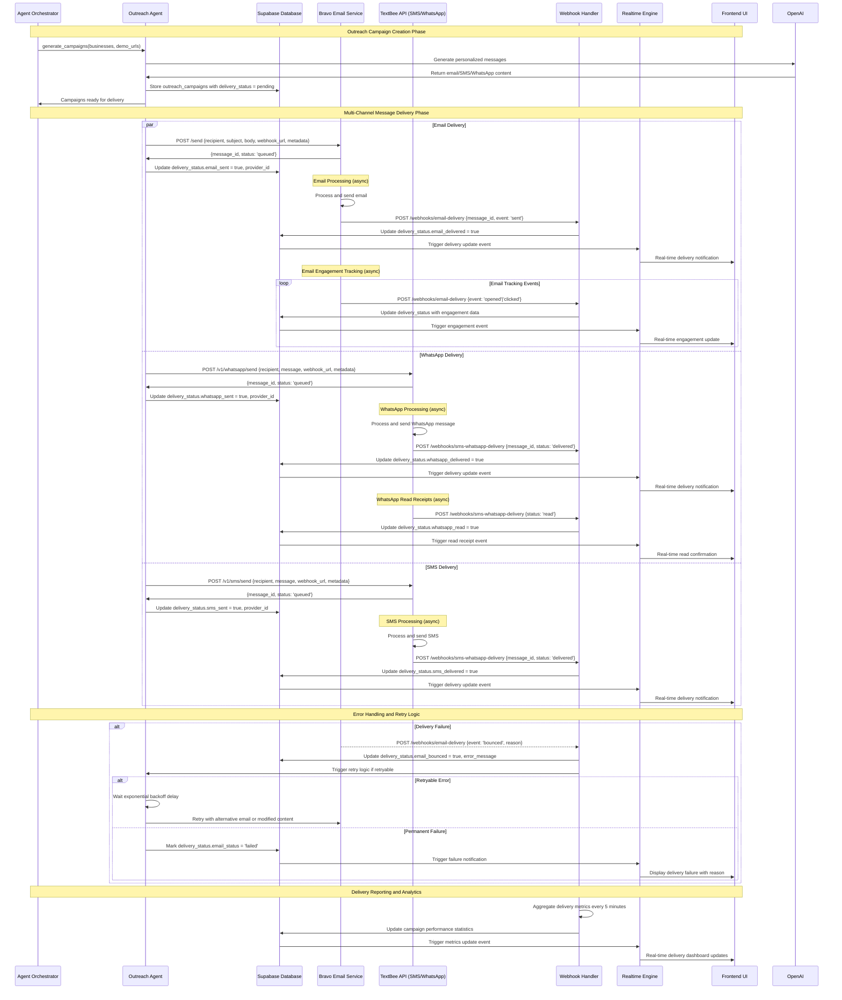
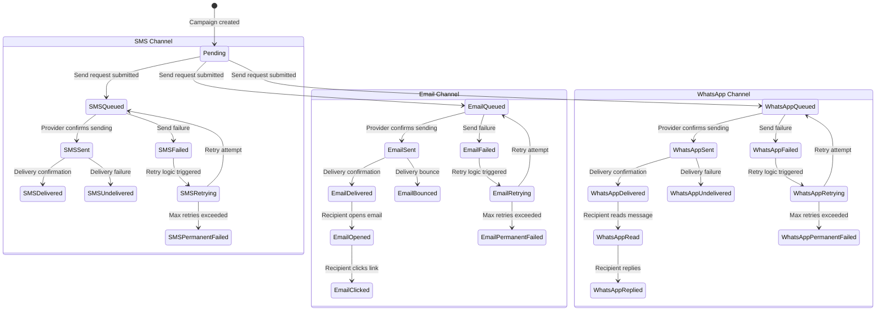

# Multi-Channel Outreach Delivery Workflow

## Outreach Delivery Sequence Diagram



## Delivery Status State Machine



## Webhook Processing Architecture

**Webhook Handler Service:**
```python
class WebhookHandler:
    async def process_email_webhook(self, payload: BravoWebhookPayload):
        """Process Bravo email delivery webhooks"""
        try:
            # Validate webhook signature
            self._verify_bravo_signature(payload)
            
            # Extract campaign context
            business_id = payload.campaign_metadata['business_id']
            campaign_id = payload.campaign_metadata['outreach_campaign_id']
            
            # Update delivery status in database
            await self.outreach_repo.update_delivery_status(
                campaign_id=campaign_id,
                channel='email',
                status_update={
                    f'email_{payload.event_type}': True,
                    f'email_{payload.event_type}_at': payload.timestamp,
                    'email_provider_id': payload.message_id,
                    'email_callback_data': payload.dict()
                }
            )
            
            # Trigger real-time notification
            await self.realtime_service.broadcast_delivery_update({
                'type': 'delivery_update',
                'business_id': business_id,
                'campaign_id': campaign_id,
                'channel': 'email',
                'status': payload.event_type,
                'timestamp': payload.timestamp
            })
            
            # Handle bounce/failure scenarios
            if payload.event_type in ['bounced', 'failed']:
                await self._handle_delivery_failure(
                    campaign_id, 'email', payload.bounce_reason or 'Unknown error'
                )
                
        except WebhookValidationError as e:
            logger.error(f"Invalid webhook signature: {e}")
            raise HTTPException(status_code=401, detail="Invalid webhook signature")
            
    async def process_textbee_webhook(self, payload: TextBeeWebhookPayload):
        """Process TextBee SMS/WhatsApp delivery webhooks"""
        # Similar implementation for SMS/WhatsApp delivery tracking
        pass
        
    async def _handle_delivery_failure(self, campaign_id: str, channel: str, error_reason: str):
        """Handle delivery failures with retry logic"""
        campaign = await self.outreach_repo.get_by_id(campaign_id)
        
        if self._is_retryable_error(error_reason) and campaign.retry_count < MAX_RETRIES:
            # Schedule retry with exponential backoff
            retry_delay = 2 ** campaign.retry_count * 60  # minutes
            await self.task_queue.schedule_retry(
                task_id=f"retry_delivery_{campaign_id}_{channel}",
                delay=retry_delay,
                payload={'campaign_id': campaign_id, 'channel': channel}
            )
        else:
            # Mark as permanently failed
            await self.outreach_repo.update_delivery_status(
                campaign_id=campaign_id,
                channel=channel,
                status_update={f'{channel}_status': 'permanent_failed'}
            )
```

---
