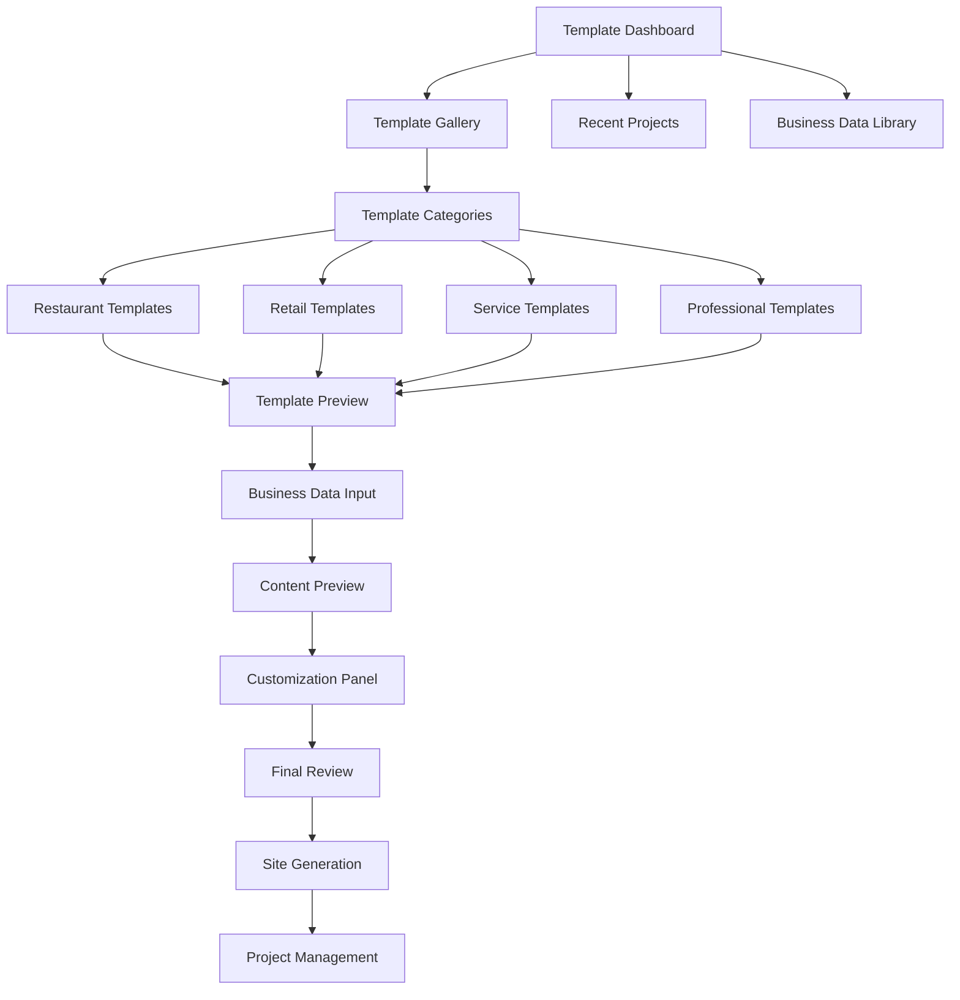

# Business Lead Generation System - Website Template Design UI/UX Specification

This document defines the user experience goals, information architecture, user flows, and visual design specifications for the Business Lead Generation System's website template design component. It serves as the foundation for visual design and frontend development, ensuring a cohesive and user-centered experience that enables lead generation agents to create professional-looking demo websites quickly.

The template system focuses on mobile-first responsive design, accessibility compliance, and conversion optimization to maximize lead generation effectiveness.

## Overall UX Goals & Principles

### Target User Personas
- **Lead Generation Agent:** The primary user who needs to create demo sites quickly
- **Business Owner:** The end user who will see the generated demo site
- **System Administrator:** Who manages the template system

### Key Usability Goals
- Speed: Create professional demo sites within 30 minutes
- Quality: Templates must look professional and trustworthy
- Consistency: All generated sites follow established design patterns
- Accessibility: Meet WCAG 2.1 AA standards for broad user reach

### Core Design Principles
- **Mobile-First Excellence** - Design for mobile users first, then enhance for larger screens
- **Conversion-Focused Design** - Every element should guide users toward business engagement
- **Professional Simplicity** - Clean, trustworthy appearance that builds business credibility
- **Accessible by Default** - Design for all users from the start, not as an afterthought

## Information Architecture

### Site Map / Screen Inventory

The template system follows a streamlined flow optimized for lead generation agents:

### Navigation Structure

**Primary Navigation:**
- Template Gallery (main entry point)
- Recent Projects (quick access to ongoing work)
- Business Data Library (saved business information)
- Help & Resources (tutorials, best practices)

**Secondary Navigation:**
- Template categories (industry-specific groupings)
- Project status indicators (draft, preview, final)
- Quick actions (duplicate project, export settings)

**Breadcrumb Strategy:**
- Always show current location: Dashboard > Template Gallery > Restaurant > Modern Restaurant Template
- Include action context: Dashboard > Template Gallery > Restaurant > Modern Restaurant Template > Customizing

## User Flows

### Primary User Flow: Template-to-Site Generation
- **User Goal:** Create a professional demo site in under 30 minutes
- **Entry Points:** Template gallery, recent projects, business data library
- **Success Criteria:** Demo site generated, URL created, ready for business presentation

### Secondary User Flow: Template Customization
- **User Goal:** Adjust template appearance to match business branding
- **Entry Points:** Content preview, customization panel
- **Success Criteria:** Visual adjustments complete, final review passed

### Tertiary User Flow: Business Data Management
- **User Goal:** Efficiently input and manage business information
- **Entry Points:** Business data input form, business data library
- **Success Criteria:** All required business data captured accurately

## Wireframes & Mockups

### Primary Design Files
**Design Tool:** Figma (recommended for collaborative design and developer handoff)
**File Structure:** 
- `templates/` - Individual template designs
- `components/` - Reusable UI components
- `layouts/` - Responsive layout variations
- `prototypes/` - Interactive prototypes for user testing

### Key Screen Layouts

#### 1. Template Dashboard
**Purpose:** Main entry point for lead generation agents
**Key Elements:**
- Quick template search and filtering
- Recent projects grid with status indicators
- Business data library shortcuts
- Quick-start templates for common business types
**Interaction Notes:** One-click template selection, drag-and-drop project organization
**Design File Reference:** `templates/dashboard-main.fig`

#### 2. Template Gallery
**Purpose:** Browse and select appropriate templates
**Key Elements:**
- Category-based template organization (Restaurant, Retail, Service, Professional)
- Template preview cards with business type indicators
- Smart recommendations based on recent selections
- Template rating and popularity indicators
**Interaction Notes:** Hover previews, category filtering, search functionality
**Design File Reference:** `templates/gallery-categorized.fig`

#### 3. Business Data Input
**Purpose:** Efficiently capture business information
**Key Elements:**
- Progressive form with smart defaults
- Auto-population from business databases
- Real-time validation and error prevention
- Business data library integration
**Interaction Notes:** Auto-save, smart suggestions, bulk import options
**Design File Reference:** `templates/data-input-progressive.fig`

#### 4. Content Preview & Customization
**Purpose:** Review and customize template content
**Key Elements:**
- Multi-device preview (mobile, tablet, desktop)
- Real-time preview updates
- Customization panel with preset themes
- Undo/redo functionality
**Interaction Notes:** Drag-and-drop customization, instant preview updates
**Design File Reference:** `templates/preview-customization.fig`

#### 5. Final Review & Generation
**Purpose:** Final approval and site generation
**Key Elements:**
- Comprehensive review checklist
- Performance and accessibility indicators
- Generation progress with time estimates
- Project management and sharing options
**Interaction Notes:** One-click generation, progress tracking, export options
**Design File Reference:** `templates/final-review-generation.fig`

## Component Library / Design System

### Design System Approach
**Custom Design System** - Built specifically for the template system on established foundations (Bootstrap/Tailwind base with custom components)

### Core Components

#### Template Cards
**Purpose:** Gallery browsing and template selection
**Variants:** Featured, standard, compact
**States:** Default, hover, selected, disabled
**Usage Guidelines:** Use for template browsing, maintain consistent sizing

#### Progressive Forms
**Purpose:** Business data input with smart defaults
**Variants:** Single-step, multi-step, wizard
**States:** Empty, filling, valid, invalid, complete
**Usage Guidelines:** Show progress indicators, auto-save frequently

#### Preview Panels
**Purpose:** Content review and customization
**Variants:** Single device, multi-device, split view
**States:** Loading, preview, editing, saving
**Usage Guidelines:** Update in real-time, show device context

#### Customization Controls
**Purpose:** Visual adjustments and branding
**Variants:** Color picker, layout adjuster, typography selector
**States:** Default, active, disabled, error
**Usage Guidelines:** Provide preset options, show live preview

#### Progress Indicators
**Purpose:** Long-running operations feedback
**Variants:** Linear, circular, step-based
**States:** Loading, progress, complete, error
**Usage Guidelines:** Show time estimates, allow cancellation

## Branding & Style Guide

### Visual Identity
**Brand Guidelines:** Custom design system built on established foundations (Bootstrap/Tailwind base with custom components)
**Design Philosophy:** Professional, trustworthy, conversion-focused while maintaining simplicity and accessibility

### Color Palette

| Color Type | Hex Code | Usage |
|------------|----------|-------|
| Primary | #2563EB (Blue-600) | Primary buttons, links, brand elements |
| Secondary | #64748B (Slate-500) | Secondary actions, borders, text |
| Accent | #F59E0B (Amber-500) | Call-to-action buttons, highlights |
| Success | #10B981 (Emerald-500) | Positive feedback, confirmations |
| Warning | #F59E0B (Amber-500) | Cautions, important notices |
| Error | #EF4444 (Red-500) | Errors, destructive actions |
| Neutral | #F8FAFC to #0F172A | Text, borders, backgrounds (slate scale) |

### Typography

#### Font Families
- **Primary:** Inter (sans-serif) - Clean, modern, highly readable
- **Secondary:** Source Sans Pro (sans-serif) - Alternative for headings
- **Monospace:** JetBrains Mono - Code snippets, technical content

#### Type Scale

| Element | Size | Weight | Line Height |
|---------|------|--------|-------------|
| H1 | 2.25rem (36px) | 700 | 1.2 |
| H2 | 1.875rem (30px) | 600 | 1.3 |
| H3 | 1.5rem (24px) | 600 | 1.4 |
| Body | 1rem (16px) | 400 | 1.6 |
| Small | 0.875rem (14px) | 400 | 1.5 |

### Iconography
**Icon Library:** Lucide Icons (consistent with modern design trends)
**Usage Guidelines:** 
- Use filled icons for primary actions, outlined for secondary
- Maintain consistent 20px size for most UI elements
- Ensure sufficient contrast with background colors
- Provide meaningful alt text for accessibility

### Spacing & Layout
**Grid System:** 8px base unit system (8, 16, 24, 32, 48, 64px)
**Spacing Scale:** Consistent spacing using CSS custom properties
**Layout Principles:** Mobile-first with progressive enhancement

## Change Log

| Date | Version | Description | Author |
|------|---------|-------------|---------|
| 2024-12-19 | 1.0 | Initial specification creation | Sally (UX Expert) |
| 2024-12-19 | 1.1 | Completed core sections through interactive elicitation | Sally (UX Expert) |

---

**Note:** This specification was created through an interactive elicitation process with the UX Expert agent. Additional sections including Accessibility Requirements, Responsiveness Strategy, Animation & Micro-interactions, Performance Considerations, and Next Steps will be completed in subsequent sessions.
